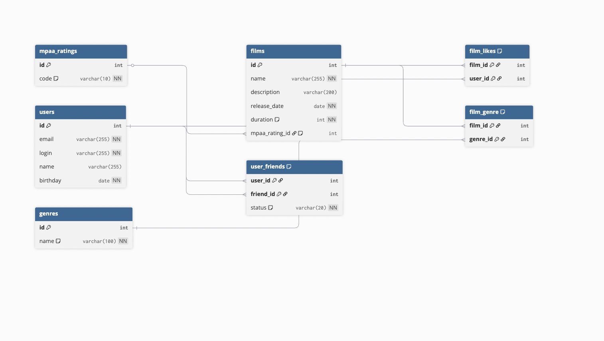

# java-filmorate

Веб-приложение для оценки фильмов и общения с друзьями.

## Схема базы данных

Диаграмма связей между таблицами (основные сущности: пользователи, фильмы, справочники жанров и рейтингов MPA; связи: дружба со статусом, лайки, жанры фильмов).



- Изображение диаграммы: [docs/database-schema.png](database-schema.png)
- Схема в dbdiagram.io: [https://dbdiagram.io/d/Sprint-11-BD-698ec772bd82f5fce29c68b6](https://dbdiagram.io/d/Sprint-11-BD-698ec772bd82f5fce29c68b6)  
- Исходник DBML в репозитории: файл `schema.dbml` в корне проекта.

### Пояснение к схеме

- **users** - пользователи (email, логин, имя, дата рождения).
- **films** - фильмы (название, описание, дата релиза, длительность); рейтинг MPA хранится по ссылке на справочник.
- **mpaa_ratings** - справочник рейтингов MPA (G, PG, PG-13, R, NC-17).
- **genres** - справочник жанров (Комедия, Драма, Мультфильм и др.).
- **film_genre** - связь «фильм - жанр» (у одного фильма может быть несколько жанров).
- **user_friends** - дружба между пользователями с направлением и статусом: `UNCONFIRMED` (запрос отправлен) или `CONFIRMED` (дружба подтверждена).
- **film_likes** - лайки пользователей фильмам (пара film_id, user_id).

### Примеры запросов для основных операций (? обозначает переменные значения)

**Получить всех пользователей:**
```sql
SELECT * FROM users;
```

**Получить все фильмы с рейтингом MPA:**
```sql
SELECT f.*, r.code AS mpaa_rating
FROM films f
LEFT JOIN mpaa_ratings r ON f.mpaa_rating_id = r.id;
```

**Получить топ N самых популярных фильмов по количеству лайков:**
```sql
SELECT f.*, COUNT(fl.user_id) AS likes_count
FROM films f
LEFT JOIN film_likes fl ON f.id = fl.film_id
GROUP BY f.id
ORDER BY likes_count DESC
LIMIT ?;
```

**Получить список друзей пользователя (только подтверждённая дружба):**
```sql
SELECT u.*
FROM users u
JOIN user_friends uf ON u.id = uf.friend_id
WHERE uf.user_id = ? AND uf.status = 'CONFIRMED';
```

**Получить общих друзей двух пользователей:**
```sql
SELECT u.*
FROM users u
JOIN user_friends uf1 ON u.id = uf1.friend_id AND uf1.user_id = ? AND uf1.status = 'CONFIRMED'
JOIN user_friends uf2 ON u.id = uf2.friend_id AND uf2.user_id = ? AND uf2.status = 'CONFIRMED';
```

**Добавить запрос в друзья (неподтверждённая связь):**
```sql
INSERT INTO user_friends (user_id, friend_id, status)
VALUES (?, ?, 'UNCONFIRMED');
```

**Подтвердить дружбу (после принятия запроса):**  
Обновить обе направленные связи: сначала строку (A, B), затем (B, A). Например, A отправил запрос, B принял - тогда первый UPDATE с параметрами (A, B), второй с (B, A).
```sql
UPDATE user_friends SET status = 'CONFIRMED' WHERE user_id = ? AND friend_id = ?;  -- параметры: (A, B)
UPDATE user_friends SET status = 'CONFIRMED' WHERE user_id = ? AND friend_id = ?;  -- параметры: (B, A)
```

**Поставить лайк фильму:**
```sql
INSERT INTO film_likes (film_id, user_id) VALUES (?, ?);
```

**Удалить лайк:**
```sql
DELETE FROM film_likes WHERE film_id = ? AND user_id = ?;
```

**Получить жанры фильма:**
```sql
SELECT g.* FROM genres g
JOIN film_genre fg ON g.id = fg.genre_id
WHERE fg.film_id = ?;
```
